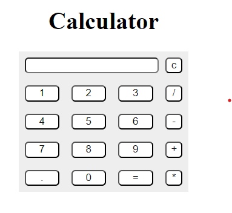

# A very simple Calculator

This is a github Repository for a capstone lab assignment.

This is a simple calculator made with HTML, CSS, and JS. The calculator uses the eval() javascript statement. While using the eval statement is a big security concern, it does not matter as you are only evaluating mathematical expressions. 
